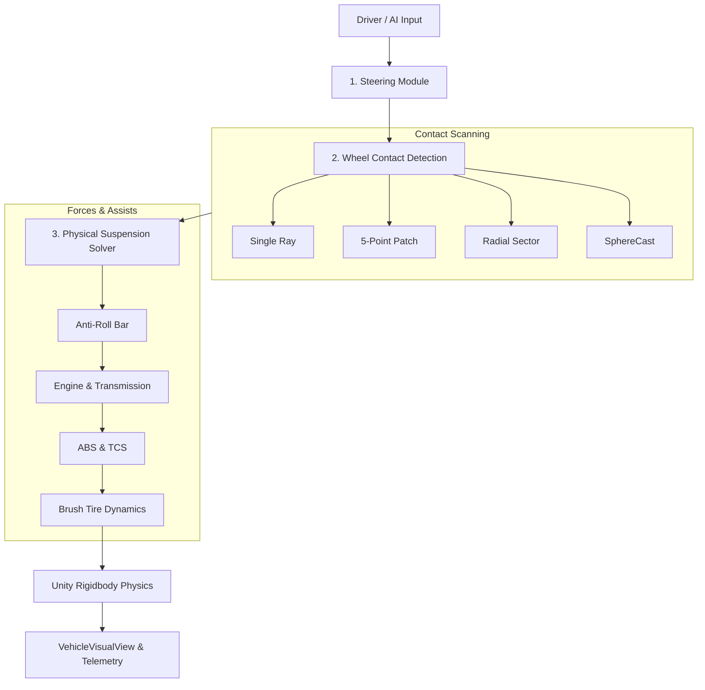

## System Overview

```mermaid
flowchart TD
    In[Driver / AI Input] --> Steer[1. Steering Module]
    Steer --> Contact[2. Wheel Contact Detection]
    subgraph ContactPatch [Contact Scanning]
        Contact --> M1[Single Ray]
        Contact --> M2[5-Point Patch]
        Contact --> M3[Radial Sector]
        Contact --> M4[SphereCast]
    end
    ContactPatch --> Susp[3. Physical Suspension Solver]
    subgraph Dynamics [Forces & Assists]
        Susp --> ARB[Anti-Roll Bar]
        ARB --> Engine[Engine & Transmission]
        Engine --> Assists[ABS & TCS]
        Assists --> Tires[Brush Tire Dynamics]
    end
    Tires --> UnityRB[Unity Rigidbody Physics]
    UnityRB --> VisView[VehicleVisualView & Telemetry]
```
